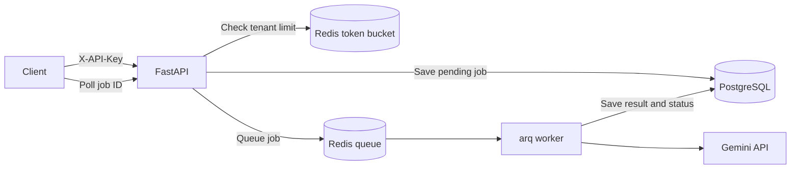

# TicketIQ

TicketIQ is a multi-tenant API that queues customer-support ticket processing so clients do not wait for slow LLM responses.

## Architecture

## Current behavior

- API keys are generated during registration and stored as SHA-256 hashes.
- Every job query is scoped to the authenticated user.
- `POST /jobs` stores a pending job, queues it, and immediately returns its ID.
- The worker processes jobs asynchronously and retries failed LLM calls three times with exponential backoff.
- A Redis token bucket limits each tenant independently and returns HTTP 429 when its bucket is empty.

## Endpoints

| Method | Path | Purpose |
|---|---|---|
| `POST` | `/register` | Register an email and receive an API key |
| `POST` | `/jobs` | Create and queue a ticket-processing job |
| `GET` | `/jobs/{job_id}` | Poll a tenant-owned job for its status and result |

Protected endpoints require the `X-API-Key` header. Interactive API documentation is available at `/docs` while the service is running.

## Why these choices

**Async FastAPI:** Postgres, Redis, and Gemini calls spend most of their time waiting on network I/O. Async code lets the server work on another request during those waits.

**Redis and arq:** The queue separates quick request acceptance from slower LLM processing. It also gives retries and background workers a clear place in the architecture.

**Token bucket:** Each tenant stores only its token balance and last refill time. The Redis Lua script updates both values atomically and allows short bursts up to the bucket capacity.

## Project status

Layers 1-4 are complete: the synchronous API was converted to async, job processing moved to a queue, and multi-tenant authentication and rate limiting were added. The next phase adds usage metering and basic observability without changing the overall structure.
