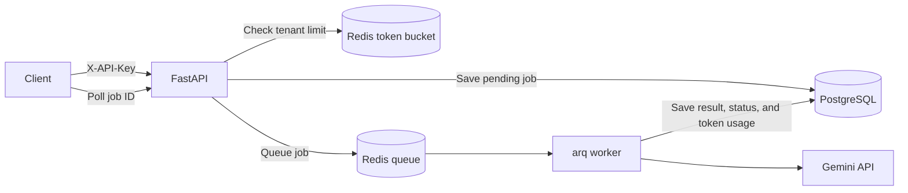

# TicketIQ

TicketIQ is a multi-tenant API that queues customer-support ticket processing so clients do not wait for slow LLM responses.

## Architecture



## Current behavior

- API keys are generated during registration and stored as SHA-256 hashes.
- Every job query is scoped to the authenticated user.
- `POST /jobs` stores a pending job, queues it, and immediately returns its ID.
- The worker processes jobs asynchronously and retries failed LLM calls three times with exponential backoff.
- A Redis token bucket limits each tenant independently and returns HTTP 429 when its bucket is empty.
- Structured logs record request duration, request IDs, job state changes, and token usage.

## Endpoints

| Method | Path | Purpose |
|---|---|---|
| `POST` | `/register` | Register an email and receive an API key |
| `POST` | `/jobs` | Create and queue a ticket-processing job |
| `GET` | `/jobs/{job_id}` | Poll a tenant-owned job for its status and result |
| `GET` | `/health` | Check PostgreSQL and Redis connectivity |
| `GET` | `/metrics` | Read the authenticated tenant's daily requests, jobs, latency, tokens, and queue depth |

Protected endpoints require the `X-API-Key` header. Interactive API documentation is available at `/docs` while the service is running.

## Run locally

```bash
docker compose up --build
```

This starts FastAPI, one arq worker, PostgreSQL, and Redis. Docker uses the local stub provider by default so testing does not consume Gemini quota. To run against Gemini outside Docker, copy `.env.example` to `.env`, add `GENAI_API_KEY`, and keep `LLM_PROVIDER=gemini`.

## Load test

```bash
python -m pip install -r requirements-dev.txt
locust --headless --users 20 --spawn-rate 5 --run-time 30s --host http://localhost:8000
```

Every simulated user receives a separate API key. This checks that concurrent tenants can queue and poll jobs independently while excess requests from one tenant receive HTTP 429 instead of reaching the worker.

### Local results

Measured on September 10 and 13, 2026 with a 30-second run and the 250 ms stub inference delay. The API and worker ran locally against PostgreSQL and Redis containers. Each row is a separate run that starts with new tenants. The 20-, 50-, and 100-tenant tests spawned 5 users/second; the 1,000-tenant stress test spawned 50 users/second so that, like the 100-tenant test, it reached its target in 20 seconds.

| Tenants | Total requests | Requests/second | Aggregate p50 | Aggregate p95 | Accepted jobs | Rate-limited submissions | Completed / failed | Unexpected failures | Final queue depth |
|---:|---:|---:|---:|---:|---:|---:|---:|---:|---:|
| 20 | 1,094 | 36.76 | 10 ms | 26 ms | 109 | 690 | 109 / 0 | 0 | 0 |
| 50 | 2,203 | 75.38 | 11 ms | 37 ms | 244 | 1,394 | 244 / 0 | 0 | 0 |
| 100 | 3,441 | 117.92 | 13 ms | 110 ms | 463 | 2,041 | 463 / 0 | 0 | 0 |
| 1,000 | 5,976 | 204.40 | 2,200 ms | 5,400 ms | 3,116 | 891 | 3,116 / 0 | 0 | 0 |

The tests show that the API continued serving requests as concurrent tenants increased, per-tenant limits rejected excess submissions, and the worker drained every accepted job after each run. At 1,000 tenants, aggregate p95 latency rose to 5.4 seconds and the queue contained 2,286 jobs when traffic stopped; the final job completed about 2 minutes 15 seconds later. This indicates local saturation rather than a successful 1,000-user production capacity target. The request rate includes fast, expected HTTP 429 responses, so it should not be interpreted as LLM job-processing throughput. These short local runs do not prove production capacity or uptime under every workload.

## Why these choices

**Async FastAPI:** Postgres, Redis, and Gemini calls spend most of their time waiting on network I/O. Async code lets the server work on another request during those waits.

**Redis and arq:** The queue separates quick request acceptance from slower LLM processing. It also gives retries and background workers a clear place in the architecture.

**Token bucket:** Each tenant stores only its token balance and last refill time. The Redis Lua script updates both values atomically and allows short bursts up to the bucket capacity.

## Observability

Each response includes an `X-Request-ID` that also appears in the structured request log. The worker logs when a job starts, completes, or exhausts its retries. Apply `migrations/001_observability.sql` before running this version so completed jobs can store their token counts.
